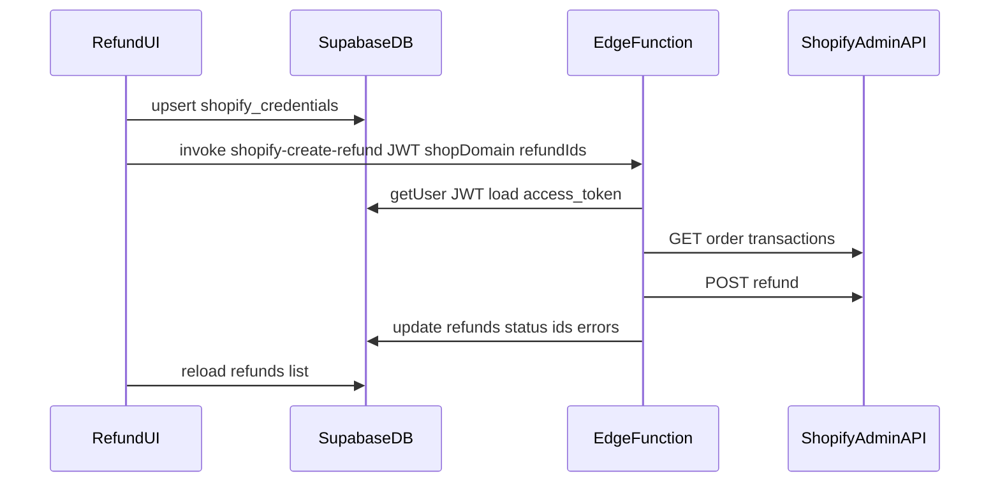

# Architecture

## Stack

- **Frontend**: Vite, React 18, TypeScript, Tailwind, shadcn/ui
- **Data**: Supabase (Postgres, Auth, Edge Functions)
- **Integrations**: Shopify Admin REST API (version `2024-10`, see [`src/lib/shopifyAdminApi.ts`](src/lib/shopifyAdminApi.ts); bump in one place when upgrading)

## Refund domain

- **`refunds` table**: Workflow queue (imports, statuses, PDFs, Shopify order snapshot fields).
- **Shopify**: System of record for money movement. A row is only truly “settled” after Shopify accepts a refund and we persist `shopify_refund_id`.

## Shopify refund requirements

### Admin API usage

| Step | Method | Purpose |
|------|--------|---------|
| Enrich import (browser, dev) | `GET /orders/{id}.json` | Line items and amounts (Vite proxy avoids CORS locally). |
| Process refund (Edge Function) | `GET /orders/{id}/transactions.json` | Find capture/sale `parent_id` and remaining refundable amount. |
| Process refund (Edge Function) | `POST /orders/{id}/refunds.json` | Create the refund. |

### App scopes (custom app)

Configure the Shopify custom app with at least:

- `read_orders`
- `read_order_transactions`
- Write access that allows creating refunds (e.g. `write_orders` / refund-related scopes per Shopify’s admin API docs for your API version)

### Security model

- The **browser must not** perform refund writes with the Admin token in production builds exposed to end users.
- **`shopify-create-refund` Edge Function** is the only component that calls Shopify with the secret token.
- The client calls the function with the user’s **Supabase JWT** (`Authorization: Bearer …`) and non-secret inputs: normalized shop domain and refund row UUIDs.
- **Secrets**: `SUPABASE_SERVICE_ROLE_KEY` and `SUPABASE_URL` are provided by Supabase at runtime; the function validates the JWT then uses the service role to read credentials and update refund rows.

### Credentials (`shopify_credentials`)

- **Client toggle**: Set `VITE_SAVE_SHOPIFY_CREDENTIALS=true` in the Vite env to persist Admin tokens in `shopify_credentials` for server-side refunds. Default (unset) is browser-only (localStorage).
- **Shopify app (OAuth)**: With `VITE_SHOPIFY_OAUTH_ENABLED=true` and Supabase credential saving on, merchants **install from Shopify Admin**. **App URL** and **redirect URL** in the Partner app must both be `{SUPABASE_URL}/functions/v1/shopify-oauth`. Install request (`?shop=&timestamp=&hmac=`, often with `embedded=1` + `host` + `id_token`) → Edge Function verifies HMAC, inserts `shopify_oauth_states` (no Supabase user yet). If `embedded=1`, **302** to `{SHOPIFY_OAUTH_RETURN_URL origin}/shopify-oauth-embed.html?authorize=…` (static `public/` page): Supabase rewrites `GET`+`text/html` from Edge Functions to `text/plain`, so HTML cannot be served from the function; the static page sets `window.top` to Shopify authorize. Otherwise **302** directly to authorize. Callback exchanges code → token stored in `shopify_oauth_pending` with **`claim_nonce`** → redirect to `SHOPIFY_OAUTH_RETURN_URL` with `?shopify_oauth=success&shop=…&shopify_claim=<uuid>`. Refund defers clearing those query params until after the **claim** `POST` (JWT body `claimNonce` and/or `shop`). Signed-in user: claim moves the token into `shopify_credentials`. Edge secrets: `SHOPIFY_CLIENT_ID`, `SHOPIFY_CLIENT_SECRET`, `SHOPIFY_OAUTH_RETURN_URL`; optional `SHOPIFY_OAUTH_EMBED_PAGE`, `SHOPIFY_OAUTH_SCOPES` (defaults match the custom-app scope list below).
- One row per `(user_id, shop_domain)` storing the Admin API access token.
- **RLS**: Users can `select` / `insert` / `update` / `delete` only rows where `user_id = auth.uid()`.
- **Plaintext token in Postgres** is acceptable only for a trusted operator surface; prefer **Shopify OAuth** for production-style deployments so tokens are scoped and revocable without DB reads.

### Idempotency and status

- **`shopify_refund_id`**: Set after Shopify returns a refund id; if already set, the Edge Function skips creating another refund for that row.
- **`shopify_refund_attempted_at`**: Timestamp of the last processing attempt.
- **`shopify_refund_error`**: Last Shopify or validation error message when status is `failed`.
- **Statuses**: `pending` → `processing` (during Edge run) → `completed` | `failed`.

### Business rules (MVP)

- Refund **amount**: `min(calculated_refund, remaining refundable balance)` on the **primary** successful `sale` / `capture` transaction (largest remaining balance wins). See [`src/lib/shopifyRefundPayload.ts`](src/lib/shopifyRefundPayload.ts).
- **Line items / restock**: Not applied in MVP; `shopify_products` line item ids are available for a future phase if you need `refund_line_items` and inventory restock.

## Flow

## Risks

- **CORS**: Browser `GET` to Shopify Admin URLs fails outside the Vite dev proxy; order enrichment in production may require a separate server route or Edge Function if you move all reads server-side.
- **Refundable mismatch**: If `calculated_refund` exceeds what the gateway allows, Shopify returns an error; the row is marked `failed` with the API message.
- **Rate limits**: Bulk runs should stay sequential or throttled (implemented as sequential in the Edge Function).
